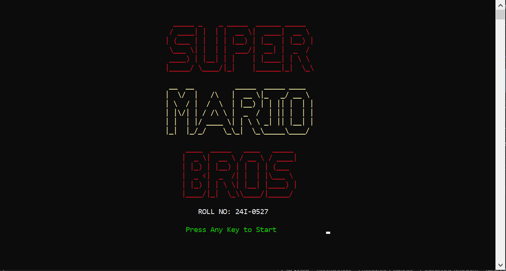
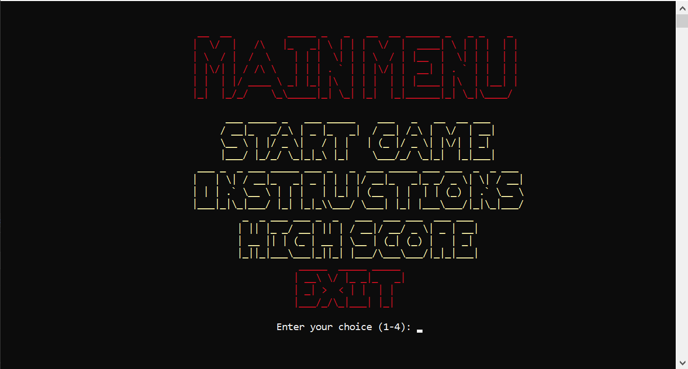
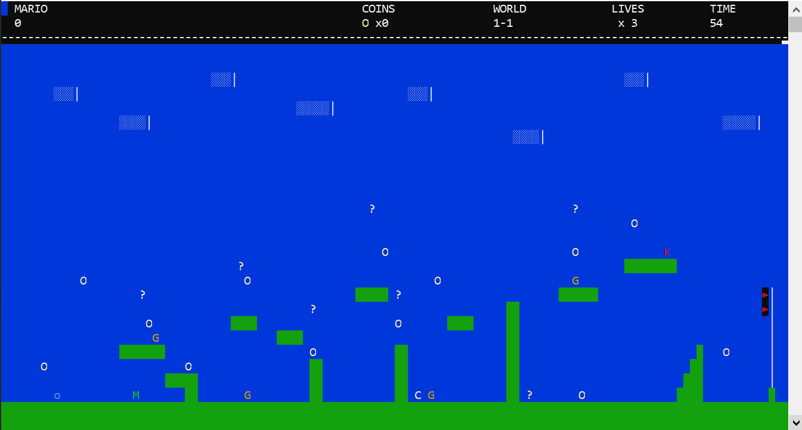
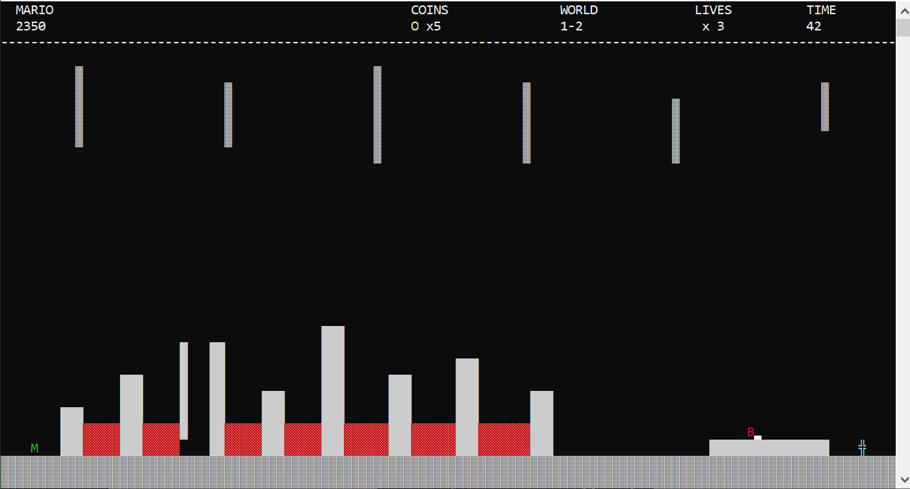

# 🍄 Super Mario — x86 Assembly

> A fully functional **Super Mario clone** built entirely in **x86 Assembly Language**, featuring 2 levels, a boss fight, enemies, power-ups, sound effects, and a complete HUD — all in pure low-level code.

---

## 🎮 Controls

| Key | Action |
|-----|--------|
| `A` | Move Left |
| `D` | Move Right |
| `W` | Jump |
| `Shift` | Shoot Fireball *(Level 1 only)* |
| `P` | Pause Game |
| `X` | Exit Game |

---

## 🖥️ Screens

- 🏁 **Title Screen**
- 📋 **Main Menu** — Start Game / Instructions / High Score / Exit
- ⏸️ **Pause Menu**
- 💀 **Game Over**
- ✅ **Level Complete**

---

## 🌍 Levels

### Level 1 — Grassland Adventure 🌿
> Classic overworld with ground, pipes, bricks, clouds, coins, and enemies.  
> **Win condition:** Reach the flag with at least **1500 points**  
> **Bonus:** Remaining time × 50 added to score

### Level 2 — Castle Fortress 🏰
> Lava floors, gray bricks, stalactites, and the final Bowser boss battle.  
> **Win condition:** Reach the blue axe tile to defeat Bowser

---

## 🧱 Tile System

The game uses a **tile-based level map** (120 × 30 tiles):

| Tile | Description |
|------|-------------|
| `TILE_EMPTY` | Background |
| `TILE_GROUND` | Grassland ground blocks |
| `TILE_BRICK` | Solid bricks |
| `TILE_QUESTION` | Question blocks with power-ups |
| `TILE_COIN` | Collectible coins |
| `TILE_CLOUD` | Decorative clouds |
| `TILE_FLAGPOLE` | End of Level 1 goal |
| `TILE_GROUND_UNDERGROUND` | Castle fortress ground |
| `TILE_LAVA` | Deadly lava — instant life loss |
| `TILE_AXE` | Defeat Bowser in Level 2 |
| `TILE_CLOCK` | ⭐ Custom power-up (time slow) |

---

## 👾 Enemies & Boss

### 🍄 Goombas × 4 *(Level 1)*
- Walk back and forth, respect gravity, turn at edges
- Defeated by **jumping on them** or **hitting with fireball**

### 🐢 Koopa Troopa *(Level 1)*
- Walks and turns like Goombas
- Turns into a **shell** when Mario jumps on it

### 🔥 Bowser *(Level 2 Boss)*
- Patrols a platform
- Fires periodic fireballs at Mario

---

## 💰 Collectibles & Power-Ups

| Item | Symbol | Reward |
|------|--------|--------|
| Coin | `O` | +200 points |
| Question Block | `?` | +100 points |
| ⭐ Clock *(Custom Feature)* | `C` | +500 pts · enemies 2× slower · timer slows · lasts 5 sec |

---

## 🔥 Fireball System

- **Mario's fireballs** → kill enemies (blue fireballs — *Fire Master Mario* theme)
- **Bowser's fireballs** → kill Mario

---

## 📊 HUD

| Element | Description |
|---------|-------------|
| `MARIO` | Score label |
| `Score` | Increases from coins, enemies, blocks & bonuses |
| `WORLD` | Current level (e.g. 1-1, 1-2) |
| `TIME` | Countdown timer |
| `× Lives` | Remaining lives |

---

## ⚙️ Physics & Engine

- ✅ Gravity system
- ✅ Smooth motion
- ✅ Jump mechanics
- ✅ Collision detection (tiles + enemies)

---

## 🔊 Sound Effects

- Mario jumping
- Collecting coins
- Hitting question blocks
- Stomping enemies
- Falling into lava

---

## 💾 File Handling (High Scores)

Each saved entry stores:
- Player name
- Score
- Level reached
- Lives remaining

---

## 🎨 Custom Roll Number Feature

> **Roll ending in 7 → "Fire Master Mario" theme** *(24I-0527)*  
> Mario shoots **blue fireballs** instead of the standard orange

---

## 📁 Project Structure

```
Mario/
├── 24I0527_mario.asm     # Full game source (x86 Assembly)
├── mariomusic.wav        # Background music
├── GameDemo.MOV          # Gameplay demo video
├── README.md
└── Screenshots/
    ├── Title_Screen.PNG
    ├── Main_Menu.png
    ├── Gameplay_lvl1.png
    ├── Gameplay_lvl2.png
    └── Level_Complete.png
```

---

## 📸 Screenshots

| Title Screen | Main Menu |
|---|---|
|  |  |

| Level 1 Gameplay | Level 2 Gameplay |
|---|---|
|  |  |

---

## 👨‍💻 Author

**Haris Said** — `24I-0527`  
COAL — Fall 2025 · Instructor: Usama Imran · FAST-NUCES

---

*HAPPY GAMING! 🎮*
